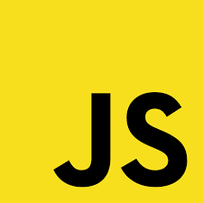

<h1 align="center">
  
</h1>

<h5 align="center">
  <code><a href="https://www.linkedin.com/in/mohamed-osama10710/" title="LinkedIn Profile"> LinkedIn</a></code>
  <code><a href="mailto:mo5709813@gmail.com" title="Email"> Email</a></code>
  <code><a href="https://github.com/mohamedosama10710" title="GitHub Profile"> GitHub</a></code>
</h5>

---

  Hi, I'm Mohamed Osama — A passionate <b>Full stack Developer</b> from Egypt.
   
   
  🚀 I build full-stack web applications using <b>MongoDB, Express.js, React.js, Node.js</b>
   
  💻 Skilled in frontend & backend development
   
  📚 Currently learning advanced system design & microservices
   
  🎯 Goal: Create scalable and high-performance applications
   
  💬 Ask me anything <a href="https://github.com/mohamedosama10710/mohamedosama10710/issues" title="Issues">here</a>
   
  📫 How to reach me:<a href="mailto:mo5709813@gmail.com">mo5709813@gmail.com</a>

---

<h2 align="center">🔥 Languages & Frameworks & Tools 🔥</h2>

  <code></code>
  <code></code>
  <code></code>
  <code></code>
  <code></code>
  <code></code>
  <code></code>
  <code></code>
  <code></code>
  <code></code>
  <code></code>
  <code></code>
  <code></code>
  <code></code>
  <code></code>
  <code></code>
  <code></code>

---
<h2 align="center">📊 GitHub Stats 📊</h2>

  
  

  

---

<h2 align="center">📌 👨‍💻 Repositories 👨‍💻 📌</h2>

  
  

---

<h4 align="center">
  <a href="https://github.com/mohamedosama10710?tab=repositories" title="Show More Repositories">🔎 Show More 🔍</a>
</h4>
